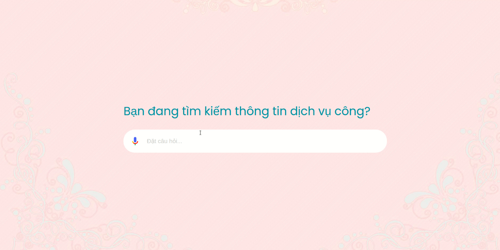
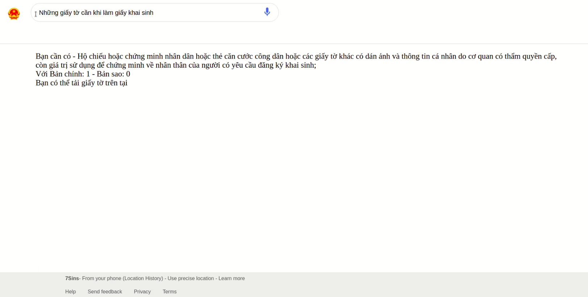

# dichvucong_7sins [WATCH VIDEO DEMO](https://youtu.be/UOl1t3dFQrY)
## Install enviroment python 
```
pip3 install SpeechRecognition
sudo apt-get install python3-pyaudio
apt install libasound2-dev portaudio19-dev libportaudio2 libportaudiocpp0 ffmpeg
pip3 install pyaudio
pip3 install playsound
pip3 install gTTS
pip3 install transformer
pip3 install underthesea
pip3 install scikit-learn
pip3 install tensorflow
pip3 install keras
pip3 install pandas
pip3 install matplotlib
pip3 install flask
```

### Run 
Run service predict
```
python3 python/Flask.py
```

Run project with Spring Boot, and go to: 
```
localhost:8080
```

## Demo 



